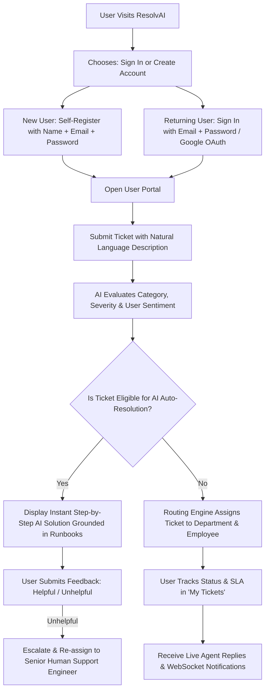
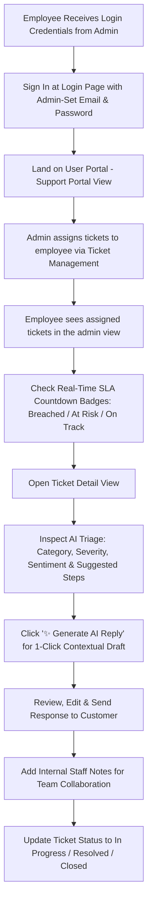
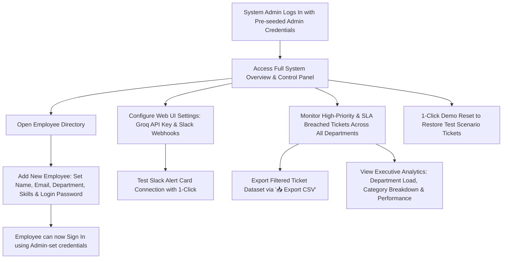

# 🤖 ResolvAI — Autonomous AI-Native Helpdesk & Incident Orchestration Platform

[](#-testing)
[](https://www.python.org/)
[](https://fastapi.tiangolo.com/)
[](https://react.dev/)
[](https://vitejs.dev/)
[](LICENSE)

> **ResolvAI** is a production-grade, AI-native internal helpdesk and workload orchestration platform. Built for modern enterprise engineering and IT teams, it combines an **Autonomous ReAct Agent Loop**, a **Hybrid Vector RAG Engine** (Dense Cosine Similarity + BM25 Reciprocal Rank Fusion), **Enterprise PII Guardrails** with Luhn verification, **Semantic Duplicate Detection & Outage Clustering**, and dynamic **Workload-Aware Ticket Routing** with a sleek, human-touch React 18 frontend and WebSocket chat bus.

---

## 🏛️ System Architecture

```
                                  +---------------------------------------+
                                  |         Web Frontend (React 18)       |
                                  | (Modern Landing, User Portal,         |
                                  |  Admin Dashboard, Analytics & Live WS)|
                                  +-------------------+-------------------+
                                                      |
                                           HTTP REST / WebSocket
                                                      |
                                                      v
                                  +---------------------------------------+
                                  |         Backend API (FastAPI)         |
                                  | (Auth, RBAC, SlowAPI Rate Limiter,    |
                                  |  Async Background SLA Automation)     |
                                  +---------+-------------------+---------+
                                            |                   |
                     +----------------------+                   +-----------------------+
                     |                                                                  |
                     v                                                                  v
    +---------------------------------+                               +----------------------------------+
    |      AI Native Engine Suite     |                               |     Routing & Workload Graph     |
    |  - Enterprise PII Guardrails    |                               |  - Workload Balancing Algorithm  |
    |  - Hybrid Vector RAG (384-D)    |                               |  - Dynamic Skill-Tag Matcher     |
    |  - Autonomous ReAct Agent Loop  |                               |  - Background SLA Sweep Engine   |
    |  - Semantic Outage Clustering   |                               +----------------+-----------------+
    |  - Groq LLaMA 3.3 70B & Claude  |                                                |
    +----------------+----------------+                                                |
                     |                                                                 |
                     v                                                                 v
    +---------------------------------+                               +----------------------------------+
    |    Database & Persistence       |                               |      External Dispatches         |
    |  - PostgreSQL (prod) / SQLite   |                               |  - Real-time WebSockets (`/ws`)  |
    |  - Alembic Schema Migrations    |                               |  - Slack Incident Alert Cards    |
    +---------------------------------+                               +----------------------------------+
```

---

## 🧠 AI-Native Architecture & Core Innovations

ResolvAI implements five foundational AI engineering modules tailored for production GenAI environments:

### 1. 🛡️ Enterprise PII Sanitizer & Security Guardrail (`guardrails.py`)
- **Zero-Data-Leakage Design**: Sanitizes all user inputs before dispatching to external LLMs.
- **Entity Detection**: Masks Credit Cards (with **Luhn checksum** validation to prevent false positives), API Keys (`sk_`, `gsk_`, JWTs, AWS credentials), Passwords, SSNs, and connection strings.
- **Structured Audit Logging**: Emits structured redaction summaries (e.g. `[AI Guardrail] Redacted: 1 credit_card, 1 api_key`).

### 2. 🔍 Hybrid Vector RAG Engine (`rag_engine.py`)
- **384-Dimensional Dense Embeddings**: Generates semantic vectors for enterprise documentation and SOP runbooks.
- **BM25 Sparse Keyword Inverted Index**: Ensures exact token matching for system codes, error identifiers, and commands.
- **Reciprocal Rank Fusion (RRF)**: Combines dense vector cosine similarity and sparse keyword scores for grounded document retrieval.
- **Automatic Source Citations**: Grounded responses include verified SOP IDs, confidence scores, and excerpt citations.

### 3. 🤖 Autonomous ReAct Agent Loop (`agent_tools.py`)
- **Thought → Action → Observation Loop**: Iteratively reasons over support issues, executes diagnostic tools, and inspects observations before producing final resolutions.
- **Tool Registry**: Pre-wired tools for `search_knowledge_base`, `check_system_health` (real-time microservice status), `inspect_user_account`, and `verify_invoice`.
- **Explainable Trace**: Logs structured reasoning steps viewable in the support dashboard for complete AI auditability.

### 4. ⚡ Semantic Duplicate Detection & Outage Clustering (`clustering_engine.py`)
- **Vector Cosine Similarity Thresholding**: Instantly identifies duplicate tickets submitted across departments (>0.85 similarity score).
- **Time-Sliding Window Clustering**: Detects cascading infrastructure outages when ≥3 correlated tickets emerge within a 60-minute window, alerting engineering leads immediately.

### 5. 🎯 Multi-Provider LLM Orchestration (`ai_service.py`)
- **Primary Inference**: High-throughput **Groq LLaMA 3.3 70B Versatile** with strict JSON schema validation.
- **Secondary Fallback**: **Anthropic Claude 3 Haiku** for high-reliability failover.
- **Deterministic Offline Fallback**: Keyword rule matrix for uninterrupted local development and testing without API keys.

### 6. 📊 Data Science & Operational Analytics Engine (`routers/analytics.py`)
- **Descriptive & Diagnostic Analytics**: Aggregates ticket lifecycles across multidimensional dimensions (department workload distribution, category frequency, severity spread).
- **Time-Series Incident Velocity**: Tracks 30-day creation vs. resolution volume trends for forecasting staffing needs and identifying bottlenecks.
- **Operational SLA & MTTR Metrics**: Calculates Mean Time to Resolution (MTTR in hours) and automated auto-resolution effectiveness scores based on user feedback.
- **Interactive Visualizations**: Powered by **Recharts** for real-time executive visibility.

---

## 🔄 User, Employee & Admin System Workflows

### 👤 1. End-User Flow (Ticket Creator / Customer)



**Step-by-step User Experience**:
1. **Authentication**: New users self-register with Full Name, Email, and Password or sign in via **Google OAuth** / Demo Quick-Logins.
2. **Submit Ticket**: Fill in the issue description in plain natural language.
3. **Instant AI Analysis**: The LLM automatically extracts category (`Access`, `Billing`, `Server`, `DB`, `HR`, `Bug`, `Feature`), severity rating, and sentiment.
4. **Auto-Resolution Check**: Common requests (password reset steps, leave policies, duplicate billing) receive instant resolution instructions grounded in SOP runbooks.
5. **Real-time Updates**: Track assigned employee status, active SLA countdowns, and chat directly with support agents over WebSockets.

---

### 👩‍💻 2. Support Employee Flow (Ticket Resolver / Support Agent)



**Step-by-step Support Employee Experience**:
1. **Account Provisioning**: Created by the System Admin in the Employee Directory.
2. **Work Queue Inspection**: View incoming tickets assigned based on skill matching and current workload.
3. **SLA Countdown & Urgency**: Monitor color-coded **SLA Badges** (`SLA Breached 🚨`, `SLA < 1h ⏱️`, `SLA On Track 💙`).
4. **AI Smart Reply Assistant**: Click **"✨ Generate AI Reply"** to generate an automated draft response powered by Groq LLaMA 3.3.
5. **Customer Communication & Notes**: Publish replies, attach internal team notes, and manage ticket status.

---

### 🛡️ 3. Admin & System Lead Flow (Management, Settings & Analytics)



**Step-by-step System Admin Experience**:
1. **Global Oversight**: Track tickets across all departments (Engineering, DevOps, IT, HR, Finance, Legal, Product).
2. **Employee Directory Management**: Add/edit support staff, update skill tags, set availability, and balance ticket workloads.
3. **Web UI Settings & Integrations**: In-browser configuration of Groq API Keys, LLM models, and Slack Webhooks with 1-click connection testing.
4. **Data Reporting & Analytics**: Export filtered tickets into CSV spreadsheets and review Recharts metrics for SLA compliance and department trends.

---

## 🛠️ Tech Stack

| Layer | Technology | Description |
|-------|-----------|-------------|
| **Frontend Core** | React 18, Vite | Modular SPA architecture with hot-module reloading and responsive layouts |
| **Motion & Design** | Framer Motion 12, Tailwind CSS 3, Lucide Icons | Modern dark-mode glassmorphic design system (`backdrop-blur`), animated illustrations, and micro-interactions |
| **Data Visualization** | Recharts | Executive time-series trends (30-day ticket velocity), MTTR calculations, category distributions, and team load analytics |
| **Backend API** | Python 3.10+, FastAPI | High-performance async REST API framework with Pydantic v2 validation |
| **Database & ORM** | SQLite (dev) / PostgreSQL (prod), SQLAlchemy 2.0 | Zero-config SQLite locally; managed PostgreSQL in production via `DATABASE_URL` with `pool_pre_ping` |
| **AI / LLM Engine** | Groq (`llama-3.3-70b-versatile`), Claude 3 Haiku | Multi-provider inference orchestration with fallback to deterministic rule matrix |
| **Vector Search & RAG** | 384-D Dense Vectors, BM25 Sparse Index | Hybrid Reciprocal Rank Fusion (RRF) for grounded enterprise runbook matching |
| **Unsupervised ML** | Cosine Similarity, Sliding-Window Clustering | Real-time semantic duplicate detection and multi-user incident cluster tracking |
| **Real-time Engine** | WebSockets (`/ws`) | Live updates for tickets, chat replies, and system notifications |
| **Notifications** | Slack Incoming Webhooks | Rich alert cards dispatched on urgent tickets or SLA escalations |
| **Auth & Identity** | JWT (HS256) + bcrypt, Google OAuth | Server-signed tokens (24 h expiry), bcrypt-hashed passwords, role-based access control (`admin` / `employee` / `user`) |
| **API Protection** | slowapi | Per-IP rate limiting: 100 req/min global, 10 req/min on login; optional Redis backend |
| **Migrations** | Alembic | Versioned schema migrations (`backend/alembic/`) |

---

## ⚡ Quick Start & Setup

### Prerequisites
- **Python**: `3.10` or higher
- **Node.js**: `18.x` or higher
- **npm**: `9.x` or higher

### 1. Backend Setup

```bash
# Navigate to backend directory
cd ai-ticketing-system/backend

# (Optional) Create and activate virtual environment
python -m venv .venv
source .venv/bin/activate  # On Windows: .venv\Scripts\activate

# Install Python dependencies
pip install -r requirements.txt

# Copy environment variables sample and set a strong SECRET_KEY
cp .env.example .env
python -c "import secrets; print(secrets.token_hex(32))"   # paste output into SECRET_KEY

# Start FastAPI dev server with auto-reload
uvicorn main:app --reload --port 8000
```
> 💡 *Note: The backend auto-creates database tables, registers system settings, seeds 15 employee directory records, and creates the bcrypt-hashed demo user accounts on first startup.*

### 2. Frontend Setup

```bash
# Navigate to frontend directory
cd ai-ticketing-system/frontend

# Install Node dependencies
npm install

# Start Vite dev server
npm run dev
```
> Open **http://localhost:5173** (or the port reported by Vite) in your browser.

---

## ⚙️ Configuration & Web UI Settings

You can configure integrations in **two ways**:

1. **Via Web UI (Recommended)**: Click **"⚙️ Integrations & AI"** in the sidebar. Enter your Groq API key or Slack Webhook URL directly from your browser. Settings are saved securely in SQLite/PostgreSQL.
2. **Via `.env` Files**:
   - **Backend (`ai-ticketing-system/backend/.env`)**:
     ```env
     SECRET_KEY=change-me-to-a-long-random-string   # REQUIRED in production
     ACCESS_TOKEN_EXPIRE_MINUTES=1440               # JWT expiry (24 h)
     ALLOWED_ORIGINS=http://localhost:5173          # CORS allow-list
     GROQ_API_KEY=gsk_your_groq_api_key_here
     SLACK_WEBHOOK_URL=https://hooks.slack.com/services/T000/B000/XXXXX
     ```
   - **Frontend (`ai-ticketing-system/frontend/.env`)**:
     ```env
     VITE_GOOGLE_CLIENT_ID=your-client-id.apps.googleusercontent.com
     VITE_API_URL=http://localhost:8000
     ```

---

## 🔐 Security & Production Readiness

| Control | Implementation |
|---|---|
| **Authentication** | Server-signed JWTs (HS256, `python-jose`); 24 h expiry via `ACCESS_TOKEN_EXPIRE_MINUTES` |
| **Password Storage** | bcrypt hashing (`backend/auth_utils.py`) — never stored or logged in plaintext |
| **Authorization** | Role-based access control on every endpoint (`require_admin`, `require_employee_or_admin`, `require_auth`); end-users can only read & create their own tickets |
| **Rate Limiting** | slowapi — 100 req/min per IP globally, 10 req/min on the login endpoint |
| **CORS** | Environment-scoped via `ALLOWED_ORIGINS`; localhost-only fallback in dev |
| **Secrets Hygiene** | Groq keys & Slack webhooks masked in API responses; settings endpoints are admin-only |
| **Deployment** | One-click Render blueprint (`render.yaml`) with managed PostgreSQL; `SECRET_KEY` set manually in the dashboard; Swagger UI disabled when `ENVIRONMENT=production` |

### Demo Accounts (seeded on startup, bcrypt-hashed in DB)

| Email | Password | Role |
|---|---|---|
| `admin@gmail.com` | `admin123` | admin |
| `employee@company.com` | `employee123` | employee |
| `user@gmail.com` | `user123` | user |

---

## 🚀 One-Click Cloud Deployment (Render Blueprint)

This repository includes a ready-to-use [`render.yaml`](render.yaml) blueprint:

1. **Push to GitHub**: Make sure your repo is pushed to GitHub.
2. **New Blueprint on Render**: In your [Render Dashboard](https://dashboard.render.com/), click **New +** → **Blueprint**, and select your GitHub repo.
3. **Automatic Provisioning**:
   - `ai-ticketing-db`: Managed PostgreSQL database.
   - `ai-ticketing-backend`: FastAPI Python Web Service running `alembic upgrade head && uvicorn main:app --host 0.0.0.0 --port $PORT`.
   - `ai-ticketing-frontend`: Vite static site deployed directly from `dist/`.
4. **Environment Variables**:
   - In Render backend settings, set `SECRET_KEY` to a random 64-char hex string:
     ```bash
     python -c "import secrets; print(secrets.token_hex(32))"
     ```
   - Add your `GROQ_API_KEY`.
   - Set `ALLOWED_ORIGINS` to your frontend's Render URL (e.g. `https://ai-ticketing-frontend.onrender.com`).

---

## 📡 Complete API Endpoints Documentation

Swagger Interactive API Docs: `http://localhost:8000/docs` (available in non-production environments).

All endpoints require an `Authorization: Bearer <JWT>` header unless marked 🔓. Role legend: 🔓 public · 👤 any authenticated user · 👩‍💻 employee/admin · 🛡️ admin only.

### 🔑 Authentication (`/api/auth`)
| Method | Endpoint | Description |
|--------|----------|-------------|
| `POST` | `/api/auth/login` | 🔓 Exchange email + password for a signed JWT (rate-limited: 10 req/min) |
| `POST` | `/api/auth/register` | 🔓 Self-register an end-user account (role is always `user`) |
| `POST` | `/api/auth/google` | 🔓 Google OAuth sign-in — provisions the user and issues a signed JWT |
| `GET` | `/api/auth/me` | 👤 Get current user's profile |
| `PUT` | `/api/auth/me/password` | 👤 Change own password |

### 🎟️ Tickets (`/api/tickets`)
| Method | Endpoint | Description |
|--------|----------|-------------|
| `POST` | `/api/tickets/` | 👤 Create a new ticket (triggers AI analysis, PII scrub, auto-resolution check, & routing) |
| `GET` | `/api/tickets/` | 👤 List tickets with filters (`status`, `department`, `severity`, `category`, `sla_status`, `search`) — end-users only see their own |
| `GET` | `/api/tickets/{id}` | 👤 Get detailed ticket object with replies, notes, SLA status, and timeline |
| `PATCH` | `/api/tickets/{id}/status` | 👩‍💻 Update ticket status (`New`, `Assigned`, `In Progress`, `Pending Info`, `Resolved`, `Closed`) |
| `POST` | `/api/tickets/{id}/notes` | 👩‍💻 Add internal employee note to a ticket |
| `POST` | `/api/tickets/{id}/replies` | 👤 Post reply — official replies restricted to admin or the assigned employee |
| `POST` | `/api/tickets/{id}/generate-reply` | 👩‍💻 ✨ Generate AI draft reply using Groq LLM |
| `GET` | `/api/tickets/{id}/timeline` | 👤 Fetch activity timeline events |
| `POST` | `/api/tickets/{id}/feedback` | 👤 Submit user satisfaction feedback (`Helpful` / `Unhelpful`) |
| `POST` | `/api/tickets/{id}/escalate` | 🛡️ Escalate ticket severity & trigger urgent Slack notification |
| `POST` | `/api/tickets/check-escalations` | 🛡️ System timer check for overdue tickets |
| `POST` | `/api/tickets/reset-seed` | 🛡️ 🔄 1-Click reset database back to initial seed dataset |

### ⚙️ System Settings (`/api/settings`)
| Method | Endpoint | Description |
|--------|----------|-------------|
| `GET` | `/api/settings/` | 🛡️ Fetch current system settings (secrets masked) |
| `POST` | `/api/settings/` | 🛡️ Save Groq API key, model choice, or Slack webhook URL |
| `POST` | `/api/settings/test-slack` | 🛡️ 🧪 Send test alert card to configured Slack channel |

### 👥 Employees (`/api/employees`)
| Method | Endpoint | Description |
|--------|----------|-------------|
| `GET` | `/api/employees/` | 👩‍💻 List employee directory with skill tags & current ticket workloads |
| `POST` | `/api/employees/` | 🛡️ Register new employee |
| `PUT` | `/api/employees/{id}` | 🛡️ Update employee details, skills, or availability |
| `DELETE` | `/api/employees/{id}` | 🛡️ Deactivate employee |

### 📊 Analytics (`/api/analytics`)
| Method | Endpoint | Description |
|--------|----------|-------------|
| `GET` | `/api/analytics/overview` | 👩‍💻 Executive KPI stats (total tickets, auto-resolved %, SLA compliance, resolution time) |
| `GET` | `/api/analytics/department-load` | 👩‍💻 Department ticket distribution for charts |
| `GET` | `/api/analytics/top-categories` | 👩‍💻 Top 5 ticket category breakdown |

### 🔌 WebSockets (`/ws`)
| Protocol | Endpoint | Description |
|----------|----------|-------------|
| `WS` | `/ws` | 🔑 Authenticated real-time WebSocket (`?token=<JWT>`) for live ticket updates and notifications |

---

## 📂 Project Structure

```
ai-QUERY/
├── render.yaml                          # Infrastructure as code: Render 1-click blueprint
├── README.md                            # Main project documentation & AI specs
└── ai-ticketing-system/
    ├── backend/
    │   ├── main.py                      # FastAPI application & WebSocket server
    │   ├── guardrails.py                # Enterprise PII scrub + Luhn verification
    │   ├── rag_engine.py                # 384-D dense embeddings + BM25 sparse RRF
    │   ├── agent_tools.py               # Autonomous ReAct agent loop & tool registry
    │   ├── clustering_engine.py         # Semantic duplicate detection & outage clustering
    │   ├── ai_service.py                # Groq LLM (LLaMA 3.3 70B) & fallback orchestrator
    │   ├── auth_utils.py                # JWT + bcrypt security & RBAC dependencies
    │   ├── routing_engine.py            # Department classification
    │   ├── assignee_engine.py           # Skill-matching & load-balancing algorithm
    │   ├── limiter.py                   # SlowAPI rate limiter
    │   ├── database.py                  # SQLAlchemy engine (SQLite / PostgreSQL)
    │   ├── models.py                    # ORM models (Users, Tickets, Employees, SOPs)
    │   ├── schemas.py                   # Pydantic v2 validation schemas
    │   ├── seed_data.py                 # Directory seeds & demo scenario tickets
    │   ├── requirements.txt             # Python dependencies
    │   ├── alembic/                     # Database migrations
    │   └── tests/                       # Complete Pytest test suite (28 tests)
    └── frontend/
        ├── package.json                 # React dependencies
        ├── vite.config.js               # Vite bundler configuration
        ├── tailwind.config.js           # Tailwind CSS styling tokens
        ├── index.html                   # HTML entry point
        └── src/
            ├── App.jsx                  # Navigation, routing & layout
            ├── api.js                   # Centralized API client
            ├── index.css                # Glassmorphic dark design system
            ├── components/
            │   ├── ResolvAiLogo.jsx     # Brand SVG logo
            │   ├── HeroIllustration.jsx # Animated SVG mesh illustration
            │   ├── PrimaryButton.jsx    # Accessible primary action button
            │   ├── SecondaryButton.jsx  # Outlined action button
            │   ├── StatCard.jsx         # Metric display card
            │   ├── DocumentationModal.jsx # Runbook & architecture docs modal
            │   └── SettingsModal.jsx    # In-browser integrations & config
            └── pages/
                ├── LandingPage.jsx      # High-conversion human-touch landing page
                ├── LoginPage.jsx        # Auth & quick-demo switchers
                ├── UserPortal.jsx       # Ticket submission & AI triage intake
                ├── MyTickets.jsx        # End-user ticket tracking
                ├── TicketList.jsx       # Staff ticket management & CSV export
                ├── TicketDetail.jsx     # Live discussion & AI Smart Reply
                ├── EmployeeDirectory.jsx# Staff skill-tag & workload manager
                └── Analytics.jsx        # Recharts executive KPI dashboard
```

---

## 🧪 Testing

The backend includes a comprehensive automated test suite covering authentication, RBAC authorization, PII guardrails, RAG, and WebSocket dispatches across 28 test cases.

To run tests:

```bash
cd ai-ticketing-system/backend

# Activate virtual environment (if using venv):
# Windows:       .venv\Scripts\activate
# Linux / macOS: source .venv/bin/activate

# Run test suite:
pytest tests/ -v
```

```
tests/test_auth_api.py ......................... [ 17%]
tests/test_employee_dashboard.py ............... [ 28%]
tests/test_genai_suite.py ...................... [ 53%]
tests/test_rbac_security.py .................... [ 71%]
tests/test_realtime.py ......................... [ 82%]
tests/test_tickets_api.py ...................... [100%]

============================= 28 passed in 1.60s ==============================
```

---

Made with ❤️ by Aditya Singh
