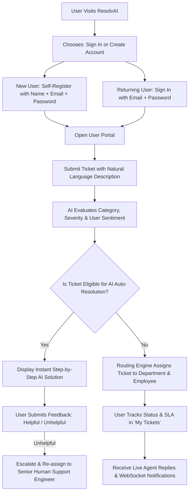
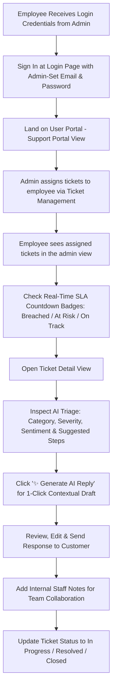
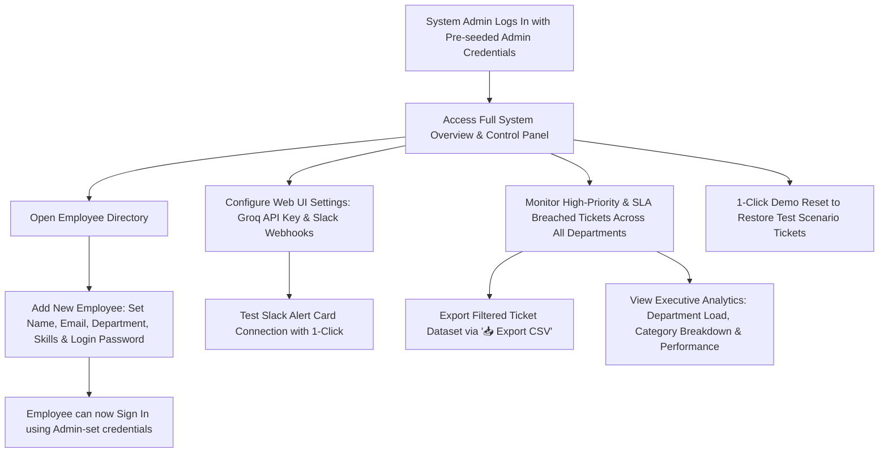

# 🤖 ResolvAI — Smart AI Ticketing & Autonomous Helpdesk System

> **ResolvAI** is an enterprise-grade AI internal ticketing platform. It uses Large Language Models (LLM) to read incoming tickets, classify severity and sentiment, auto-resolve common inquiries, route complex issues to the best-suited employees based on skill tags and workload, track SLAs with real-time countdown badges, and notify teams via Slack.

---

## 🏛️ Architecture

```
                                  +---------------------------------------+
                                   |         Web Frontend (React 18)       |
                                   | (Landing, User Portal, Admin Dashboard|
                                   |    Settings Modal, Role-Based Auth)   |
                                  +-------------------+-------------------+
                                                      |
                                          HTTP REST / WebSocket
                                                      |
                                                      v
                                  +---------------------------------------+
                                  |         Backend API (FastAPI)         |
                                  |     (Routers: Tickets, Employees,     |
                                  |          Analytics, Settings)         |
                                  +---------+-------------------+---------+
                                            |                   |
                     +----------------------+                   +-----------------------+
                     |                                                                  |
                     v                                                                  v
    +---------------------------------+                               +----------------------------------+
    |         AI Engine Layer         |                               |     Routing & SLA Logic        |
    |  - Groq LLaMA 3.3 70B LLM       |                               |  - Department Category Mapping   |
    |  - Auto-Resolution Engine       |                               |  - Skill Tag Match & Load Balancing|
    |  - AI Smart Reply Assistant     |                               |  - SLA Status & Escalation Timers|
    |  - Offline Keyword Fallback     |                               +----------------+-----------------+
    +----------------+----------------+                                                |
                     |                                                                 |
                     v                                                                 v
    +---------------------------------+                               +----------------------------------+
    |     System Settings & SQLite    |                               |      External Dispatches         |
    |  - SQLite (tickets, employees)  |                               |  - Real-time WebSockets (`/ws`)  |
    |  - SystemSetting key-value DB   |                               |  - Slack Webhook Cards           |
    +---------------------------------+                               +----------------------------------+
```

---

## 🔄 User, Employee & Admin System Workflows

### 👤 1. End-User Flow (Ticket Creator / Customer)



**Step-by-step User Experience**:
1. **Registration**: New users **self-register** with Full Name, Email, and Password on the Sign In / Create Account page. Registration always creates an **End-User** (Support Portal) account.
2. **Login**: Returning users sign in with their email and password. Demo accounts available for quick access.
3. **Submit Ticket**: Fill in the issue description in plain text.
4. **Instant AI Analysis**: The LLM automatically extracts category (`Access`, `Billing`, `Server`, `DB`, `HR`, `Bug`, `Feature`), severity rating, and sentiment.
5. **Auto-Resolution Check**: Common requests (password reset steps, leave policies, duplicate billing) receive instant resolution instructions.
6. **Real-time Updates**: Track assigned employee status, active SLA countdowns, and chat directly with support agents.

---

### 👩‍💻 2. Support Employee Flow (Ticket Resolver / Support Agent)



**Step-by-step Support Employee Experience**:
1. **Account Creation**: Accounts are **created by the System Admin** in the Employee Directory. The admin sets the employee's email and login password.
2. **Login**: Employee signs in using the email and password set by the admin — from the same login page, using the **Sign In** tab.
3. **Work Queue Inspection**: View incoming tickets assigned based on skill matching and current workload.
4. **SLA Countdown & Urgency**: Monitor color-coded **SLA Badges** (`SLA Breached 🚨`, `SLA < 1h ⏱️`, `SLA On Track 💙`).
5. **AI Smart Reply Assistant**: Click **"✨ Generate AI Reply"** to generate an automated draft response powered by Groq LLaMA 3.3.
6. **Customer Communication & Notes**: Publish replies, attach internal team notes, and manage ticket status (`In Progress`, `Pending Info`, `Resolved`, `Closed`).

---

### 🛡️ 3. Admin & System Lead Flow (Management, Settings & Analytics)



**Step-by-step System Admin Experience**:
1. **Login**: Admin uses the pre-seeded demo credentials (`admin@gmail.com` / `admin123`) — there is no admin self-registration.
2. **Employee Management**: Add support staff by filling in their Name, Email, Department, Skills, and **Login Password**. Employees then log in with those admin-set credentials.
3. **Global Oversight**: Track tickets across all departments (Engineering, DevOps, IT, HR, Finance, Legal, Product).
4. **Web UI Settings & Integrations**: In-browser configuration of Groq API Keys, LLM models, and Slack Webhooks with 1-click connection testing.
5. **Data Reporting & Analytics**: Export filtered tickets into CSV spreadsheets and review Recharts metrics for SLA compliance and department trends.

---

## 🛠️ Tech Stack

| Layer | Technology | Description |
|-------|-----------|-------------|
| **Frontend Core** | React 18, Vite | SPA with fast hot-reloading & clean modular component architecture |
| **Styling & Icons** | Tailwind CSS 3, Lucide Icons | Modern dark-mode glassmorphic design system |
| **Data Visualization** | Recharts | Interactive department load, category, and sentiment analytics |
| **Backend API** | Python 3.10+, FastAPI | High-performance async REST API framework |
| **Database & ORM** | SQLite, SQLAlchemy | Relational DB with automatic schema migrations & key-value settings storage |
| **AI / LLM Engine** | Groq (`llama-3.3-70b-versatile`) | Ultra-fast LLM inference with smart offline fallback mode |
| **Real-time Engine** | WebSockets (`/ws`) | Live updates for tickets, chat replies, and system notifications |
| **Notifications** | Slack Incoming Webhooks | Rich alert cards dispatched on urgent tickets or SLA escalations |
| **Auth & Identity** | Email + Password (localStorage) | Self-registration for End-Users; Employee accounts set by Admin; Admin via pre-seeded credentials |

---

## ⚡ Quick Start & Setup

### Prerequisites
- **Python**: `3.10` or higher
- **Node.js**: `18.x` or higher
- **npm**: `9.x` or higher

### 1. Backend Setup

```bash
# Navigate to backend directory
cd backend

# Install Python dependencies
pip install -r requirements.txt

# (Optional) Copy environment variables sample
cp .env.example .env

# Start FastAPI dev server with auto-reload
uvicorn main:app --reload --port 8000
```
> 💡 *Note: The backend auto-creates SQLite tables, registers system settings, and seeds 15 employee directory records on first startup.*

### 2. Frontend Setup

```bash
# Navigate to frontend directory
cd frontend

# Install Node dependencies
npm install

# Start Vite dev server
npm run dev
```
> Open **http://localhost:5173** in your browser.

---

## ⚙️ Configuration & Web UI Settings

You can configure integrations in **two ways**:

1. **Via Web UI (Recommended)**: Click **"⚙️ Integrations & AI"** in the sidebar. Enter your Groq API key or Slack Webhook URL directly from your browser. Settings are saved securely to SQLite.
2. **Via `.env` File**:
   ```env
   GROQ_API_KEY=gsk_your_groq_api_key_here
   SLACK_WEBHOOK_URL=https://hooks.slack.com/services/T000/B000/XXXXX
   ```

---

## 📡 Complete API Endpoints Documentation

Swagger Interactive API Docs: `http://localhost:8000/docs`

### 🎟️ Tickets (`/api/tickets`)
| Method | Endpoint | Description |
|--------|----------|-------------|
| `POST` | `/api/tickets/` | Create a new ticket (triggers AI analysis, auto-resolution check, & routing) |
| `GET` | `/api/tickets/` | List tickets with filters (`status`, `department`, `severity`, `category`, `sla_status`, `search`) |
| `GET` | `/api/tickets/{id}` | Get detailed ticket object with replies, notes, SLA status, and timeline |
| `PATCH` | `/api/tickets/{id}/status` | Update ticket status (`New`, `Assigned`, `In Progress`, `Pending Info`, `Resolved`, `Closed`) |
| `POST` | `/api/tickets/{id}/notes` | Add internal employee note to a ticket |
| `POST` | `/api/tickets/{id}/replies` | Post public reply to ticket conversation |
| `POST` | `/api/tickets/{id}/generate-reply` | ✨ Generate AI draft reply using Groq LLM |
| `GET` | `/api/tickets/{id}/timeline` | Fetch activity timeline events |
| `POST` | `/api/tickets/{id}/feedback` | Submit user satisfaction feedback (`Helpful` / `Unhelpful`) |
| `POST` | `/api/tickets/{id}/escalate` | Escalate ticket severity & trigger urgent Slack notification |
| `POST` | `/api/tickets/check-escalations` | System timer check for overdue tickets |
| `POST` | `/api/tickets/reset-seed` | 🔄 1-Click reset database back to initial seed dataset |

### ⚙️ System Settings (`/api/settings`)
| Method | Endpoint | Description |
|--------|----------|-------------|
| `GET` | `/api/settings/` | Fetch current system settings & integration configuration states |
| `POST` | `/api/settings/` | Save Groq API key, model choice, or Slack webhook URL |
| `POST` | `/api/settings/test-slack` | 🧪 Send test alert card to configured Slack channel |

### 👥 Employees (`/api/employees`)
| Method | Endpoint | Description |
|--------|----------|-------------|
| `GET` | `/api/employees/` | List employee directory with skill tags & current ticket workloads |
| `POST` | `/api/employees/` | Register new employee |
| `PUT` | `/api/employees/{id}` | Update employee details, skills, or availability |
| `DELETE` | `/api/employees/{id}` | Deactivate employee |

### 📊 Analytics (`/api/analytics`)
| Method | Endpoint | Description |
|--------|----------|-------------|
| `GET` | `/api/analytics/overview` | Executive KPI stats (total tickets, auto-resolved %, SLA compliance, resolution time) |
| `GET` | `/api/analytics/department-load` | Department ticket distribution for charts |
| `GET` | `/api/analytics/top-categories` | Top 5 ticket category breakdown |

### 🔌 WebSockets (`/ws`)
| Protocol | Endpoint | Description |
|----------|----------|-------------|
| `WS` | `/ws` | Real-time WebSocket connection for live ticket updates and notifications |

---

## 🧪 Example Test Tickets

The system includes 10 pre-built test ticket scenarios (`backend/seed_data.py`):

1. **Password reset request** → *Auto-Resolved by AI*
2. **Server is completely down — URGENT** → *Assigned to DevOps (Critical Severity)*
3. **Database query taking too long** → *Assigned to Engineering (Critical Severity)*
4. **Leave policy inquiry** → *Auto-Resolved by AI*
5. **Billing discrepancy** → *Auto-Resolved by AI*
6. **Feature request: Dark mode** → *Assigned to Product*
7. **Access permissions after role change** → *Assigned to IT Support (High Severity)*
8. **Payroll calculation error** → *Assigned to Finance*
9. **Application crash on CSV export** → *Assigned to Engineering*
10. **Compliance review needed** → *Assigned to Legal*

---

## 🚀 Key Modules & Feature Walkthrough

### 1. 🔑 Authentication & Google OAuth
Supports Email/Password sign-in & registration, **Google OAuth ("Continue with Google")** with a 1-click account picker, and instant **Demo User / Demo Admin** fast-logins.


### 2. 🌐 Landing Page & Interactive AI Demo Modal
Features a landing page highlighting AI automation capabilities and an interactive **Live AI Processing Simulation Modal**.

### 3. ✍️ Ticket Intake & AI Triage (User Portal)
Users submit issues in natural language. The AI immediately analyzes category, severity (`Critical`, `High`, `Medium`, `Low`), sentiment (`Frustrated`, `Polite`, `Neutral`), and confidence score.


### 4. ⚡ Auto-Resolution Engine
For standard requests (password resets, leave policy FAQs, billing double-charges), the AI provides instant resolution steps with a user feedback loop (`Helpful` / `Unhelpful`).


### 5. 🔀 Intelligent Department & Employee Routing
Complex issues are routed to departments (Engineering, DevOps, IT, HR, Finance, Legal, Product) and assigned to employees based on **skill tags**, **current ticket workload**, and **availability**.


### 6. ⏱️ SLA Countdown & Status Badges
Tracks strict Service Level Agreements based on severity:
- `Critical`: 2 Hours
- `High`: 6 Hours
- `Medium`: 24 Hours
- `Low`: 48 Hours
Visual badges highlight tickets as **`SLA Met ✓`**, **`SLA On Track 💙`**, **`SLA < 1h ⏱️`**, or **`SLA Breached 🚨`**.

### 7. ✨ AI Smart Reply Assistant
Support agents can click **"✨ Generate AI Reply"** on any ticket detail page. The Groq LLM reads conversation context and crafts a professional draft response.

### 8. ⚙️ Web UI Settings & Integration Manager
In-browser modal to manage Groq API Keys, select LLM models, configure Slack Webhooks, test connections, or reset demo seed data.

### 9. 📥 CSV Ticket Export
Download filtered ticket datasets into formatted `.csv` spreadsheets with 1-click.

### 10. 📊 Executive Analytics Dashboard
Visualizes ticket volume trends, department workloads, category distributions, and SLA metrics via Recharts.


---

## 📂 Project Structure

```
ai-ticketing-system/
├── backend/
│   ├── main.py                 # FastAPI application & WebSocket server
│   ├── database.py              # SQLite connection & SQLAlchemy Session
│   ├── models.py                # ORM Database Models (Ticket, Employee, SystemSetting, etc.)
│   ├── schemas.py               # Pydantic validation schemas
│   ├── ai_service.py            # Groq LLM integration + Smart Offline Engine
│   ├── routing_engine.py        # Rule-based department classification
│   ├── assignee_engine.py       # Skill-matching & load-balancing algorithm
│   ├── seed_data.py             # 15 seed employees & 10 demo scenario tickets
│   ├── requirements.txt         # Python dependencies
│   ├── .env.example             # Sample environment configuration
│   └── routers/
│       ├── tickets.py           # Ticket CRUD, SLA tracking, AI reply & seed reset
│       ├── settings.py          # System settings & Slack webhook verification
│       ├── employees.py         # Employee directory CRUD
│       └── analytics.py         # Dashboard analytics & charts
├── frontend/
│   ├── package.json             # React dependencies
│   ├── vite.config.js           # Vite configuration
│   ├── tailwind.config.js       # Tailwind CSS theme tokens
│   ├── index.html               # Entry HTML
│   └── src/
│       ├── main.jsx             # React DOM root
│       ├── App.jsx              # Navigation sidebar, router & layout
│       ├── api.js               # Centralized REST API client
│       ├── index.css            # Custom CSS & glassmorphic design system
│       ├── components/
│       │   ├── SettingsModal.jsx      # Web UI Integrations & Settings modal
│       │   ├── DemoOverlayModal.jsx   # Interactive AI processing demo overlay
│       │   ├── LandingCarousel.jsx    # Hero feature carousel
│       │   ├── ResolvAiLogo.jsx       # SVG Brand Logo
│       │   └── TicketFlowGraph.jsx    # Interactive lifecycle graph
│       └── pages/
│           ├── LandingPage.jsx        # Public landing & feature showcase
│           ├── LoginPage.jsx          # Auth, Google OAuth & Demo Quick-Logins
│           ├── UserPortal.jsx         # User ticket submission & intake
│           ├── MyTickets.jsx          # End-user ticket tracking
│           ├── TicketList.jsx         # Support Agent / Admin ticket management & CSV export
│           ├── TicketDetail.jsx       # Ticket conversation, AI Smart Reply & notes
│           ├── EmployeeDirectory.jsx  # Employee directory & workload manager
│           └── Analytics.jsx          # Recharts executive analytics dashboard
└── README.md
```

---

## ⚠️ Known Limitations

1. **Local Authentication**: User sessions are currently client-managed with role state in local storage. Production enterprise deployments should attach JWT token verification middleware.
2. **SQLite Database**: SQLite is lightweight and zero-config for local development/demos. Large enterprise instances should switch to PostgreSQL.
3. **Groq Rate Limits**: Groq's free tier has rate limits; the built-in offline engine handles rate limit fallbacks seamlessly without breaking requests.

---

## 🔮 Future Improvements

1. 🧠 **Vector DB & RAG (Retrieval-Augmented Generation)**:
   - Integrate ChromaDB or FAISS vector database to store embeddings of all resolved tickets and internal documentation.
   - Enables semantic similarity search so the AI learns from past human resolutions to answer complex technical queries automatically.
2. 🔐 **Enterprise Single Sign-On (SSO)**:
   - SAML 2.0 / OpenID Connect integration for Okta, Azure AD, and Google Workspace.
3. 🐘 **PostgreSQL & Redis Caching**:
   - Migrate database layer to PostgreSQL with Redis caching for high-concurrency enterprise workloads.
4. 📧 **Inbound Email Ingestion Gateway**:
   - Parse incoming support emails (`support@company.com`) via IMAP/SendGrid Webhooks directly into AI tickets.

---

Made with ❤️ by Aditya Singh
